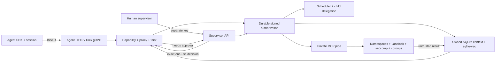

# Praesidionyx

An operating layer for AI agents, with humans supervising through a separate API.
The seven-milestone local MVP implements capability-scoped tools, Linux confinement,
sticky taint and exact-request approvals, context paging, budgets and child delegation.
Praesidionyx is a coined name inspired by Latin *praesidium* (protection).
[Try the browser demonstration](https://huggingface.co/spaces/drmbios/praesidionyx)
or [browse the source](https://github.com/drmbios/praesidionyx).
The Space demonstrates policy decisions in your browser; Linux enforces the real runtime locally.

## Quickstart — Apple Silicon + Docker Desktop

Prerequisites: running Docker Desktop with Linux containers, Docker Compose, and Python 3.
From this directory, no native Rust or API key is needed:

```sh
python3 scripts/quickstart.py
```

This builds/boots the arm64 daemon, runs all seven offline mock demos, verifies the
signed audit and reports elapsed time. Compose uses an unoptimized build without debug
symbols for a shorter first compilation. Cached startup is under five minutes on the
verified host; first image/dependency downloads depend on bandwidth and Docker resources.
Use `PRAESIDIONYX_BUILD_PROFILE=release docker compose up --build -d --wait` for optimized builds.
The current renamed full run took **272.6 seconds** with cached base images/toolchains,
rebuilt packages/binaries and concurrent verification. An earlier cached run took 113.7 s; this is not a guarantee for an uncached download on another host.
If Docker Desktop stalls during package downloads, retry with
`PRAESIDIONYX_BUILD_NETWORK=host python3 scripts/quickstart.py`. This changes only
build downloads inside Docker's Linux VM; runtime isolation stays the same.
The quickstart explicitly selects mock, clears the remote API key and keeps credentials
out of terminal output. A model service is unnecessary.

Run individual headline demos after boot:

```sh
python3 examples/injection-demo/demo.py
python3 examples/researcher/demo.py
python3 examples/memory/demo.py
python3 examples/scheduler/demo.py
```

The injection page contains a hidden write instruction. A deterministic adversarial
harness attempts that write through real MCP, receives `needs_approval`, denies it via
the supervisor CLI, and proves the file was never created. The researcher demo shows
an approved summary write. Both use fixed immutable offline web fixtures; these are
policy/confinement demonstrations, not tests of a live model's resistance to injection.

```sh
docker compose exec --user 10001:10001 praesidionyxd praesidionyx features
docker compose exec --user 10001:10001 praesidionyxd praesidionyx list-agents
docker compose exec --user 10001:10001 praesidionyxd praesidionyx approvals
docker compose exec --user 10001:10001 praesidionyxd praesidionyx audit verify
docker compose exec --user 10001:10001 praesidionyxd praesidionyx audit tail --limit 5
docker compose down
```

Agent HTTP binds host loopback **18080**, supervisor HTTP **18081**. gRPC uses separate
Unix sockets and separate keys. State persists in a named volume. Do not remove that
volume to resolve an audit error. Agent registry, identities, sessions and approvals
are ephemeral; memory persists without an agent recovery API.

## How it works



Every tool effect needs a valid exact agent/tool/path-or-URL capability. Untrusted
context additionally requires approval for writes, HTTP and child creation. Approval
never bypasses capability, budget or confinement checks. Labels survive derived data,
inter-agent messages, paging and rollback. The model cannot clear taint or mint authority.

`fs.read`, `fs.write` and `http.get` run in disposable workers with seven namespaces,
fully enforced Landlock V3, a seccomp allowlist, CPU/memory/PID cgroups, a 10-second
per-call deadline and 32 KiB UTF-8 I/O. Only authorized public IPv4 HTTP(S) destinations
receive a preconnected socket; redirects/private addresses are denied. Two reserved
immutable demo URLs are explicit offline exceptions to DNS resolution. Missing mandatory
controls disable tools and appear in the feature report; eBPF is diagnostic.

Biscuit attenuation preserves ancestor checks and shared durable quotas. The scheduler
enforces token, wall-time, tool-call and cost budgets, supports pause/resume/kill, and
cascades parent termination. Children reserve parent budget and receive a narrower tool
token. Memory uses deterministic lexical embeddings and byte-based context estimates.
Checkpoint/rollback restores resident memory, never prior authority or external effects.

The daemon makes one initial provider completion per spawn; SDK programs drive subsequent
syscalls. It is a kernel/API MVP, with no autonomous planner, human shell, GUI, arbitrary
code tool or hostile multi-tenant guarantee.

## Providers and credentials

Copy `.env.example` to `.env` for overrides; never commit it. `mock` is offline and default.
For local Metal-backed inference, select `PRAESIDIONYX_PROVIDER=ollama`, set `PRAESIDIONYX_MODEL`
to an installed model, and use `OLLAMA_BASE_URL=http://host.docker.internal:11434`.
For Anthropic, select `anthropic`, supply `ANTHROPIC_API_KEY`, pin `PRAESIDIONYX_MODEL`, and
set positive conservative `PRAESIDIONYX_INPUT_MICROUSD_PER_TOKEN` and
`PRAESIDIONYX_OUTPUT_MICROUSD_PER_TOKEN` matching your contract. Spawn with a positive cost
budget (`praesidionyx spawn --cost-microusd ...`). Provider contracts are tested with offline
HTTP fixtures; live inference and paid billing have not been verified here.

`praesidionyx spawn` is a human provisioning command that issues a one-use bootstrap token
through the supervisor socket unless supplied a token file. Its JSON response contains
secret session/exit/local capabilities; save it privately rather than print it in shared
logs. The Python SDK never mints authority. See [API](docs/api.md) for request shapes.
Provider usage limits are accounting controls; cancellation cannot guarantee that a
remote service stops billing immediately.

## Verification and terminal recording

```sh
./scripts/check.sh
./scripts/check-sandbox.sh
./scripts/audit.sh
sh scripts/demo.sh
python3 scripts/record-demo.py
```

The first script fetches dependencies, then runs workspace tests, rustfmt and strict
Clippy with Cargo offline and Docker networking disabled. The second explicitly runs
real confinement and cancellation checks offline. CI uses native arm64/amd64 runners,
all seven demos and cargo-audit. CI does not publish images. GitHub Actions also checks the browser policy and JavaScript syntax.

Replay [the recording](docs/demo.cast) with `asciinema play docs/demo.cast`, or read
[the transcript](docs/demo-transcript.txt). The recorder captures only fixed demos,
never an interactive shell or environment. See [verification](docs/verification.md),
[architecture](docs/architecture.md), [threat model](docs/threat-model.md),
[milestones](docs/milestones.md), [runtime setup](docker/README.md), and
[Hugging Face hosting / rename migration](docs/hosting.md).

This local MVP trusts the host, Docker administrator, kernel, daemon and fixed adapters.
Audit/checkpoint joint rollback, disk quotas, recovery, revocation, remote anchoring,
rate limiting and production hardening remain open. The dependency audit retains an
unsuppressed upstream maintenance warning; details are in the verification report.
